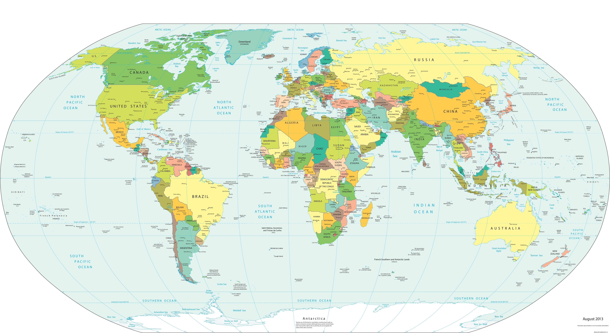

# **Python API Challenge: What's the Weather Like?**

# Background 

The task is to answer a fundamental question: "What's the weather like as we approach the equator?"

By utilising Python requests, APIs and JSON I am able to answer this question and present some meaningful conclusions .
 

# Part I: WeatherPy

By utilising OpenWeatherMap API and Python library's Citypy, I created a Python script to visualise the weather of 500+ cities across the world of varying distance from the equator.

I created a series of scatterplots to showcase the following relationships:
* Temperature (F) vs. Latitude
* Humidity (%) vs. Latitude
* Cloudiness (%) vs. Latitude
* Wind Speed (mph) vs. Latitude

To dive a little deeper, I plotting some linear regressions on each relationship based on the Northern and Southern Hemsiphere:
* Northern Hemisphere - Temperature (F) vs. Latitude
* Southern Hemisphere - Temperature (F) vs. Latitude
* Northern Hemisphere - Humidity (%) vs. Latitude
* Southern Hemisphere - Humidity (%) vs. Latitude
* Northern Hemisphere - Cloudiness (%) vs. Latitude
* Southern Hemisphere - Cloudiness (%) vs. Latitude
* Northern Hemisphere - Wind Speed (mph) vs. Latitude
* Southern Hemisphere - Wind Speed (mph) vs. Latitude

